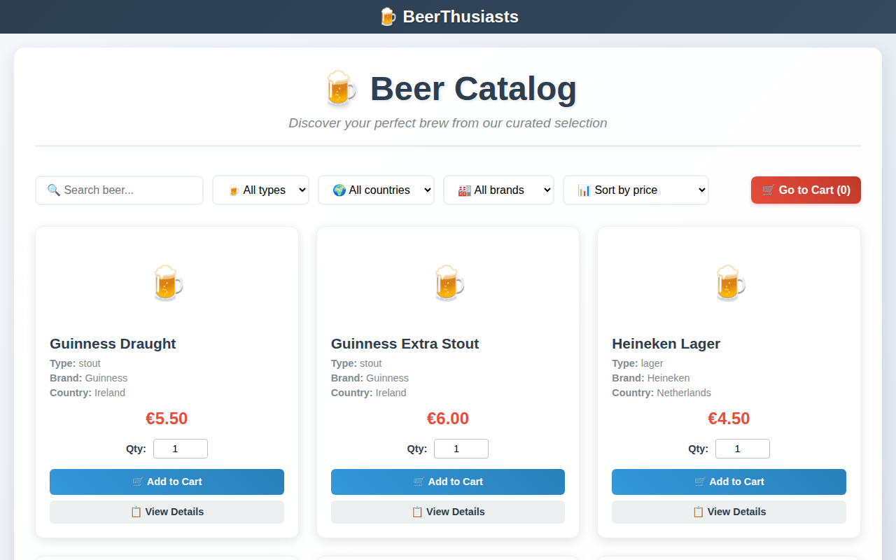
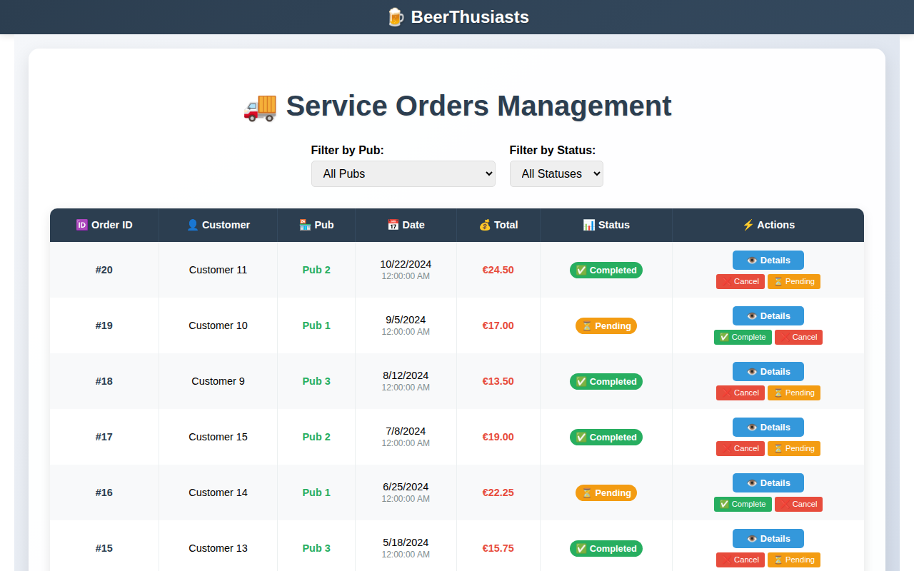
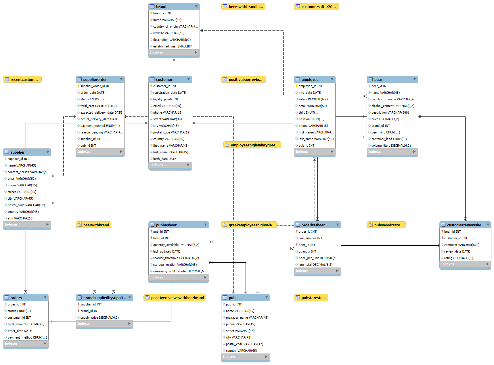

# 🍺 BeerThusiasts

**A relational database, with a full-stack web app on top, for managing the products, stock and sales of a multinational chain of beer pubs.**

Team project for the *Databases* course, School of Electrical & Computer Engineering, Aristotle University of Thessaloniki (winter semester 2025–26).


### 🔗 [Live demo](LIVE_DEMO_URL)

*Sample data only. The demo database is reset to its original state every day.*

<p align="center">
  
  
</p>

---

## Overview

BeerThusiasts models the day-to-day operation of a network of pubs that specialise in beer:

- **Products:** beers (kind, ABV, container, volume), brands and the suppliers that distribute them
- **Stock:** per-pub inventory with reorder thresholds and automatic "needs restock" detection
- **Sales:** customer orders with multiple order lines, and orders placed to suppliers
- **People:** customers (with loyalty points), employees per pub, and customer reviews of beers

The project was delivered in three stages:

| # | Deliverable | Where to find it |
|---|-------------|------------------|
| 1 | **Design:** requirements, user roles, ER model, relational schema, views | [`docs/report.pdf`](docs/report.pdf) (in Greek) |
| 2 | **Implementation in MySQL:** schema, sample data, user roles & privileges, queries | [`database/`](database) |
| 3 | **User interface:** React + Express web application | [`app/`](app) |

## Database design

<p align="center">
  
</p>

**12 tables:** `beer`, `brand`, `supplier`, `brandsuppliedbysupplier`, `pub`, `pubhasbeer`, `employee`, `customer`, `customerreviewsbeer`, `orders`, `orderhasbeer`, `supplierorder`

Highlights:
- Many-to-many relationships resolved with junction tables (`pubhasbeer` for stock, `orderhasbeer` for order lines, `brandsuppliedbysupplier` for supply prices)
- Integrity enforced in the schema with foreign keys, `CHECK` constraints (e.g. ABV between 0 and 100, non-negative prices) and `ENUM` domains
- **10 views** for common questions, e.g. `pubsneedrestock`, `positivebeerreviews`, `greekemployeeshighsalary`
- **4 database roles** with least-privilege grants ([`users.sql`](database/users.sql)):

| Role | Access |
|------|--------|
| Administrator | Everything, including user management |
| Pub manager | Stock, suppliers and supplier orders; read-only access to customer orders |
| Employee | Register customer orders; read stock |
| Customer | Browse beers, brands and pubs; place orders and reviews; update own profile |

The six example queries of Deliverable 2 are in [`database/queries/`](database/queries), with a short description of each below:

| File | Question answered |
|------|-------------------|
| `query1.sql` | Lagers over 5% ABV from American brands, with the brand's website |
| `query2.sql` | Extreme reviews (>4 or <1) by Greek customers for Guinness or Murphy beers |
| `query3.sql` | Beers that have never been ordered |
| `query4.sql` | Customers who have never written a review |
| `query5.sql` | Lagers stronger than 6% ABV |
| `query6.sql` | Average rating per beer |

## The web application

The app lets you enter as one of three roles from the home page:

- **Customer:** browse and filter the catalog, read and write reviews, add to cart, check out at a pub
- **Service employee:** manage incoming customer orders (complete / cancel / reopen)
- **Admin:** manage beers, pubs, inventory, employees and suppliers, see which pubs need restocking, and place supplier orders

There is also a *Playroom* with a few beer-themed mini-games.

> Role selection is a simple front-end choice for demo purposes; there is no login or server-side authentication.
> In the live demo, image uploads are disabled.

## Running it

### Option A: Docker (recommended, any OS)

You only need [Docker Desktop](https://www.docker.com/products/docker-desktop/).

```bash
git clone https://github.com/st-elliee/BeerThusiasts.git
cd BeerThusiasts
docker compose up --build
```

Then open **http://localhost:3000**. The first start takes a few minutes, because Docker builds the images and loads the sample data.

| Service | URL |
|---------|-----|
| Web app | http://localhost:3000 |
| REST API | http://localhost:5001/api/beers |
| MySQL | `localhost:3307`, user `root`, password `beerthusiasts` |

To stop the app, press `Ctrl+C`. To start again from a fresh database, run `docker compose down -v`.

### Option B: Run locally without Docker (Windows)

You need Node.js 18+ and a running MySQL 8 server.

1. Copy `app/backend/.env.example` to `app/backend/.env` and set your MySQL password.
2. From the `app/` folder, run:
   ```powershell
   .\setup-and-launch.ps1
   ```
   This installs the dependencies, creates and seeds the database, and starts the backend on port 5001 and the frontend on port 3000.

### Only the database (Deliverable 2)

```bash
mysql -u root -p < database/dbdump.sql      # schema + sample data
mysql -u root -p < database/users.sql       # roles & privileges (demo passwords)
mysql -u root -p beerthusiasts < database/queries/query1.sql
```

## Deployment

The live demo runs on free tiers:

| Part | Hosting |
|------|---------|
| Frontend | [Vercel](https://vercel.com) (project root: `app/frontend`) |
| Backend | Vercel, Express as a serverless function (project root: `app/backend`) |
| Database | [Aiven for MySQL](https://aiven.io/mysql) |

A daily [Vercel Cron Job](app/backend/vercel.json) calls `/api/cron/reset-demo`, which rebuilds the database from `app/backend/db-init/`.
The backend's environment variables are documented in [`app/backend/.env.example`](app/backend/.env.example).

## Project structure

```
beerthusiasts/
├── docs/
│   ├── report.pdf            # Deliverable 1: design report (Greek)
│   ├── er-diagram.png        # Relational schema
│   └── screenshots/
├── database/                 # Deliverable 2
│   ├── dbdump.sql            # Schema, views and sample data
│   ├── users.sql             # Roles and privileges
│   ├── queries/              # Example queries
│   └── beerthusiasts.mwb     # MySQL Workbench model
├── app/                      # Deliverable 3
│   ├── backend/              # Express REST API (mysql2)
│   │   └── db-init/          # Schema + seed data used by the app
│   └── frontend/             # React single-page app
└── docker-compose.yml
```

## Team

- **Elisavet Stougiannou**
- **Stergios Loukas** ([@sterlouk](https://github.com/sterlouk))
- **Aikaterini Mitropoulou**

After the course, the repository was reorganised for publication. The changes were a Docker setup, a hosted live demo, database credentials moved into environment variables, table-name fixes so the SQL runs on Linux/macOS, and consolidated documentation.

The web application was built with the help of AI coding assistants. Third-party code is credited in [THIRD_PARTY_NOTICES.md](THIRD_PARTY_NOTICES.md).

*All data in the database is fictional.*
